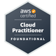
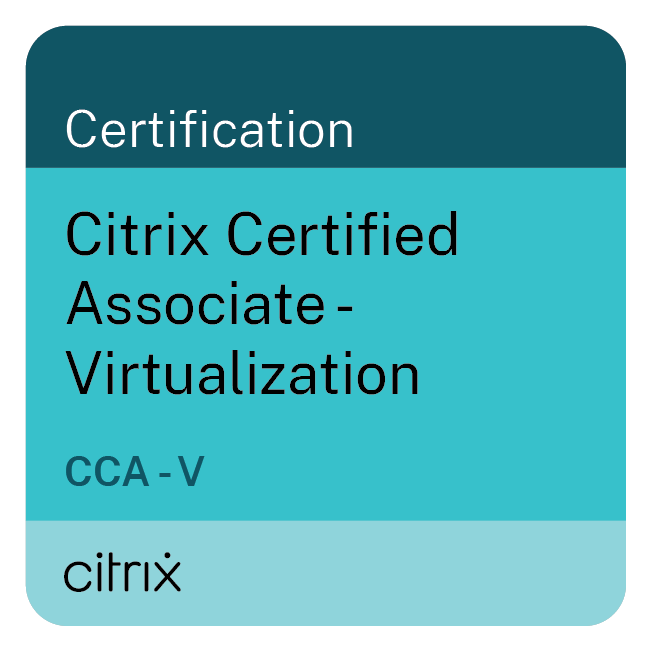

<h1 align="center">Olá ☁️, seja bem-vindo(a)!</h1>

<h3 align="center">
Cloud Analyst @ Populos · AWS · Citrix · Linux · Terraform · Cloud Engineering
</h3>

---

Sou profissional de tecnologia com foco em Cloud Computing, Virtualização e Infraestrutura.

Atualmente atuo como Cloud Analyst na Populos, trabalhando com ambientes corporativos de alta disponibilidade, sustentação e troubleshooting. Possuo 4 certificações AWS e a certificação Citrix Certified Associate – Virtualization (CCA-V), consolidando conhecimentos em arquitetura, operações, desenvolvimento e virtualização de ambientes corporativos.

Em Cloud Computing, participo de iniciativas relacionadas à governança, segurança, otimização de custos (FinOps), recuperação de desastres (Disaster Recovery), alta disponibilidade e sustentação de ambientes produtivos, contribuindo para a operação e evolução de infraestruturas críticas em nuvem.

Também atuo na sustentação e troubleshooting de ambientes corporativos utilizando Citrix DaaS, CVAD, Netscaler e soluções de virtualização, garantindo disponibilidade, performance e continuidade operacional para ambientes críticos.

Tenho experiência atuando em clientes corporativos de diferentes segmentos, participando de atividades de sustentação, troubleshooting avançado, documentação técnica, análise de incidentes e implementação de melhorias em plataformas de Cloud e Virtualização.

Atualmente concentro meus estudos em Kubernetes, Terraform, Linux e Arquitetura Cloud, aprofundando conhecimentos em automação, containers, observabilidade e boas práticas de engenharia de infraestrutura.

🎓 Graduando em Sistemas de Informação pela Universidade Anhembi Morumbi (UAM).

 

🚀 <b>Principais tecnologias:</b>

- AWS
- Citrix DaaS / CVAD
- Terraform
- Linux
- Netscaler
- Docker
- Networking
- FinOps

 

🎓 <b>Certificações:</b>

 
  
   
  
   
   

📚 <b>Atualmente estudando:</b>

- Kubernetes
- Terraform
- DevOps & GitOps
- Arquitetura Cloud

 

🌎 <b>Idiomas:</b>

 Português | 🇧🇷 

 English | 🇺🇸

 

🏈 <b>Fora da tecnologia:</b> academia, futebol americano (SeaHawks 🦅💙💚🩶), games e desenvolvimento pessoal.

 

💬 Gosto de compartilhar conhecimentos sobre <b>Cloud Computing, AWS, Linux e Virtualização</b>. Fique à vontade para conectar-se comigo!

---

<h3 align="left">Linguagens e Ferramentas</h3>

  

---

<h3 align="left">Siga-me nas redes sociais</h3>

  

  

  

 

